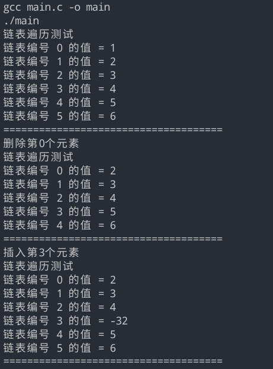

# 链表的操作

代码的修改 主要是添加了插入和删除2个函数，原本的插入函数我写成了append。

```c
// 插入函数append,会有一个数据,插入成功返回root地址
pNode append(pNode head, int data)
{
    pNode node = (pNode)malloc(sizeof(Node)); //分配内存失败，就返回0
    if (!node)
    {
        return NULL;
    }
    node->data = data;
    node->next = NULL;
    node->pre = head;
    head->next = node;
    return node;
}
```

```c
/**
 * 输入：       root的地址
 *             需要删除的索引
 * 输出：       root的地址
 **/
// 在这里似乎不可以使用remove作为函数名
pNode delete (pNode head, int index)
{
    if (index == 0)
    {
        printf("删除第%d个元素\n", index);
        head = head->next;
        return head;
    }
    printf("删除第%d个元素\n", index);
    index -= 1;
    int count = 0;
    // temp是第1个节点的地址
    pNode temp = head->next;
    while (temp)
    {
        if (count == index)
        {
            temp->next = temp->next->next;
            return head;
        }
        temp = temp->next;
        count += 1;
    }
}
```

```c
/**
 * 输入：       root的地址
 *             index 插入的索引
 *             data  插入的数据
 * 返回：       root的地址
 **/

pNode insert(pNode head, int index, int data)
{
    printf("插入第%d个元素\n", index);
    int count = 0;
    // temp是第1个节点的地址
    pNode temp = head->next;
    while (temp)
    {
        if (count == index)
        {
            pNode tmp = temp;
            temp = append(temp->pre, data);
            temp->next = tmp;
            return head;
        }
        temp = temp->next;
        count += 1;
    }
}
```

main函数的实现

```c
int main()
{
    pNode root = init();
    pNode node1, node2, node3, node4, node5, node6;
    node1 = append(root, 1);
    node2 = append(node1, 2);
    node3 = append(node2, 3);
    node4 = append(node3, 4);
    node5 = append(node4, 5);
    node6 = append(node5, 6);
    traverse(root);
    PRINT_;

    root = delete (root, 0);
    traverse(root);
    PRINT_;

    root = insert(root, 3, -32);
    traverse(root);
    PRINT_;

    return 0;
}
```

程序的输出



or

```shell
lcs@lcs-PC:~/Desktop/考研的代码/postgraduateReview/2.线性表/linked_list$ make
gcc main.c -o main
./main
链表遍历测试
链表编号 0 的值 = 1
链表编号 1 的值 = 2
链表编号 2 的值 = 3
链表编号 3 的值 = 4
链表编号 4 的值 = 5
链表编号 5 的值 = 6
=====================================
删除第0个元素
链表遍历测试
链表编号 0 的值 = 2
链表编号 1 的值 = 3
链表编号 2 的值 = 4
链表编号 3 的值 = 5
链表编号 4 的值 = 6
=====================================
插入第3个元素
链表遍历测试
链表编号 0 的值 = 2
链表编号 1 的值 = 3
链表编号 2 的值 = 4
链表编号 3 的值 = -32
链表编号 4 的值 = 5
链表编号 5 的值 = 6
=====================================
```