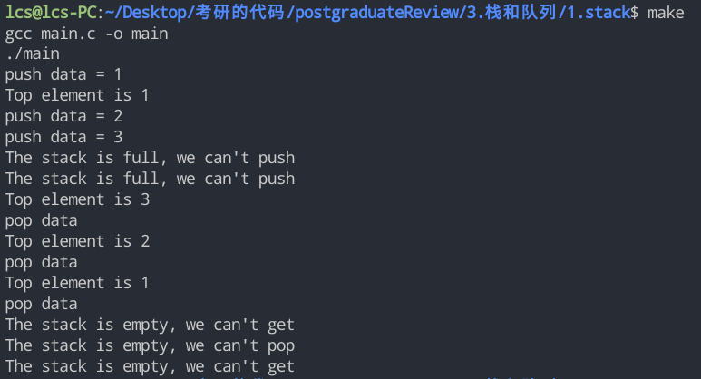

# 栈的操作

我主要是在老师的基础上面定义了一个栈的结构体和一个表示真假的枚举变量（不定义也可以使用c的`#include <stdbool.h>`）去实现这个功能，不过自己定义的话顺便复习一下枚举类型也是不错的。

栈的结构体是这么定义的

```c
#define LEN 3
typedef int DataType;
typedef struct Stack
{
    DataType data[LEN];
    int top;
} Stack;
```

布尔值是这么定义的

```c
typedef enum Boolen
{
    False = 0,
    True = 1,
} Boolen;
```

具体的代码还是看看`main.c`中具体的实现，其实和上课的代码逻辑差不多的。

main函数里面的代码我就在这边贴出来看看

```c
int main()
{
    Stack stack_test = init();
    stack_test = push(stack_test, 1);
    PRINT_TOP_ELEMENT(getTop(stack_test));
    stack_test = push(stack_test, 2);
    stack_test = push(stack_test, 3);
    stack_test = push(stack_test, 4);
    stack_test = push(stack_test, 5);
    PRINT_TOP_ELEMENT(getTop(stack_test));

    stack_test = pop(stack_test);
    PRINT_TOP_ELEMENT(getTop(stack_test));
    stack_test = pop(stack_test);
    PRINT_TOP_ELEMENT(getTop(stack_test));
    stack_test = pop(stack_test);
    PRINT_TOP_ELEMENT(getTop(stack_test));
    stack_test = pop(stack_test);
    PRINT_TOP_ELEMENT(getTop(stack_test));
    return 0;
}
```

运行截图如下



or

```
lcs@lcs-PC:~/Desktop/考研的代码/postgraduateReview/3.栈和队列/1.stack$ make
gcc main.c -o main
./main
push data = 1
Top element is 1
push data = 2
push data = 3
The stack is full, we can't push
The stack is full, we can't push
Top element is 3
pop data
Top element is 2
pop data
Top element is 1
pop data
Top element is -65532
The stack is empty, we can't pop
Top element is -65532
```

我定义的栈的大小是LEN = 3，这意味着如果我push了3次之后，就不能继续push了，会提示你栈满了才对。对应的程序是在这边。

```
lcs@lcs-PC:~/Desktop/考研的代码/postgraduateReview/3.栈和队列/1.stack$ make
gcc main.c -o main
./main
push data = 1                        -> 第1次push了数据1
Top element is 1                     -> 获取栈顶元素1
push data = 2                        -> 第2次push了数据2
push data = 3                        -> 第3次push了数据3
The stack is full, we can't push     -> 第4次尝试push，提示栈满了
The stack is full, we can't push     -> 第5次尝试push，提示栈满了
```

说明我们main函数的前半段测试push的是没有问题的，getTop也可以正常运行的。

然后我们测试了pop的运行情况，我这个-65532是定义的栈空时默认的输出
`#define STACK_NULL -65532`

```
Top element is 3                     -> 首先getTop 应该输出栈顶元素 = 3
pop data                             -> 第1次pop
Top element is 2                     -> 栈顶元素 = 2
pop data                             -> 第2次pop
Top element is 1                     -> 栈顶元素 = 1
pop data                             -> 第3次pop
Top element is -65532                -> 栈顶元素 = STACK_NULL
The stack is empty, we can't pop     -> 第4次pop，提示不可以了，因为栈空了
Top element is -65532                -> 栈顶元素 = STACK_NULL
```